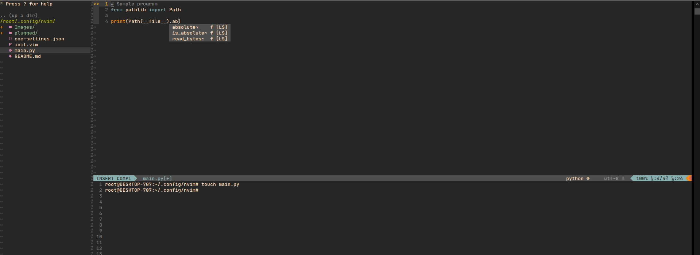

# My neovim configuration!

This is a repo where all my neovim config files are.

```bash
mkdir -p $HOME/.config/nvim
cd $HOME/.config/nvim
touch init.vim
touch coc-settings.json # If you're gonna use "coc.nvim" plugin.
```

## Screenshots


